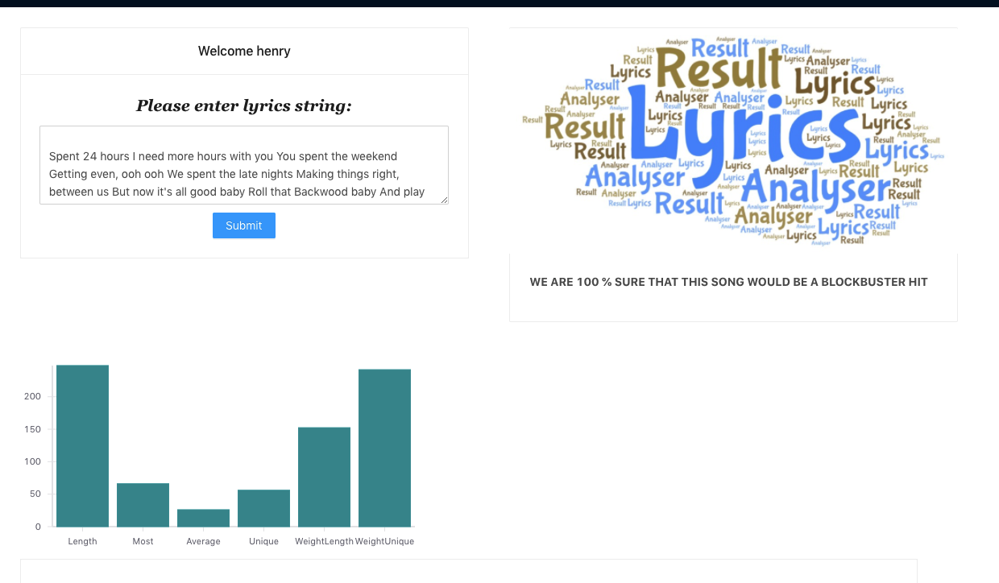
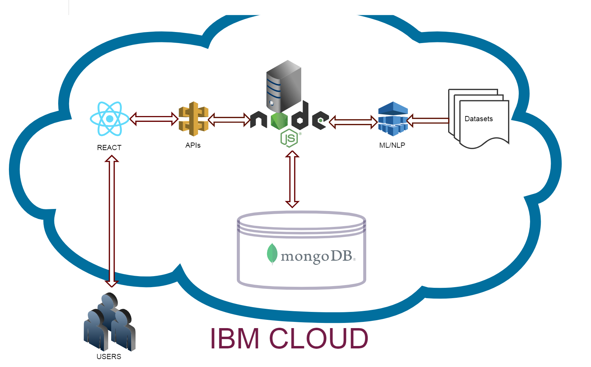

(Group Members: Amit Sharma, Ambika Na, Deepa Vyasabhat, Jaspreet Singh)

# Project Name

## Lyrics Analyser

# Abstract

There are millions of songs out there. However, only a handful of them can be considered popular. Can we build a system that can predict whether a song can be popular based on it's lyrics? Using advanced NLP and ML techniques, we think this is possible. This tool would have a significant impact on aspiring song writers.

The project is based on natural language processing over the existing lyrical dataset of over 5000+ popular songs and then using machine learning algorithms to generate a prediction model for guessing popularity of new songs based on keywords extracted from the lyrical dataset. The prediction model will be based upon the data extracted from already hit songs and will try to estimate the popularity of new songs based upon song’s length, repetition of words, usage of pop culture keywords. 

We have utilized an open source dataset from Kaggle website, consisting of 5000+ popular hit songs from various genres and timescale. The data consists of many variables like performing artist, genre, total word length, year of release. Through, natural language processing we are extracting key features to prepare our dataset which will be used by machine learning algorithms. Some of the key features in our cleaned dataset are "most often used words", "average length" etc. 
We have used knn algorithm, random forest, linear regression, logistic regression to generate a prediction model which will conclude whether a provided lyrics could be popular or not. 

We have developed a website for aspiring song writers. They can register to our system and can view their past searched lyrics. We are also providing visualisation to users based on the cleaned dataset which will help users in deciding which words to include while writing lyrics. It will also help them in gaining insights into behavior and structure of popular songs.  

This tool can be used in the music industry by artists associated with it ranging from lyricists, singers and music directors. 

# Demo

Input string 1: 

"Spent 24 hours I need more hours with you You spent the weekend Getting even, ooh ooh We spent the late nights Making things right, between us But now it's all good baby Roll that Backwood baby And play me close 'Cause girls like you Run around with guys like me 'Til sundown, when I come through I need a girl like you, yeah yeah Girls like you Love fun, yeah me too What I want when I come through I need a girl like you, yeah yeah Yeah yeah yeah Yeah yeah yeah I need a girl like you, yeah yeah Yeah yeah yeah Yeah yeah yeah I need a girl like you, yeah yeah I spent last night On the last flight to you Took a whole day up Trying to get way up, ooh ooh We spent the daylight Trying to make things right between us And now it's all good baby Roll that Backwood baby And play me close 'Cause girls like you Run around with guys like me 'Til sundown, when I come through I need a girl like you, yeah yeah Girls like you Love fun, yeah me too What I want when I come through I need a girl like you, yeah yeah Yeah yeah yeah Yeah yeah yeah I need a girl like you, yeah yeah Yeah yeah yeah Yeah yeah yeah I need a girl like you, yeah yeah I need a girl like you, yeah yeah I need a girl like you Maybe it's 6:45 Maybe I'm barely alive Maybe you've taken my shit for the last time, yeah Maybe I know that I'm drunk Maybe I know you're the one Maybe I'm thinking it's better if you drive 'Cause girls like you Run around with guys like me 'Til sundown, when I come through I need a girl like you, yeah yeah 'Cause girls like you Run around with guys like me 'Til sundown, when I come through I need a girl like you, yeah yeah Girls like you Love fun, yeah me too What I want when I come through I need a girl like you, yeah yeah Yeah yeah yeah Yeah yeah yeah I need a girl like you, yeah yeah Yeah yeah yeah Yeah yeah yeah I need a girl like you"

Output 1:

Input string 2:

an American multinational conglomerate technology company based in Seattle, with 750,000 employees.[8] It focuses on e-commerce, cloud computing, digital streaming, and artificial intelligence. It is considered one of the Big Four tech companies, along with Google, Apple, and Microsoft.[9][10][11] It has been referred to as "one of the most influential economic and cultural forces in the world."[12] Amazon is known for its disruption of well-established industries through technological innovation and mass scale.[13][14][15] It is the world's largest online marketplace, AI assistant provider, and cloud computing platform[16] as measured by revenue and market capitalization.[17] Amazon is the largest Internet company by revenue in the world.[18] It is the second largest private employer in the United States[19] and one of the world's most valuable companies. Amazon was founded by Jeff Bezos in Bellevue, Washington, in July 1994. The company initially started as an online marketplace for books but later expanded to sell electronics, software, video games, apparel, furniture, food, toys, and jewelry. In 2015, Amazon surpassed Walmart as the most valuable retailer in the United States by market capitalization.[20] In 2017, Amazon acquired Whole Foods Market for US$13.4 billion, which vastly increased Amazon's presence as a brick-and-mortar retailer.[21] In 2018, Bezos announced that its two-day delivery service, Amazon Prime, had surpassed 100 million subscribers worldwide.

Output 2:

Input String 3: 

"Lately you have been asking me
If all my words are true
Don't you know I'll do anything for you
Sometimes I haven't been good to you
Sometimes I've made you cry
And I am sorry for everything
But I promise you girl
I promise you this
When the blue night is over my face
On the dark side of the world in space
When I'm all alone with the stars above
You are the one I love
So there's no need to worry girl
My heart is sealed for you
And no one's gonna take it away
Cos' I promise you girl
I promise you this
When the blue night is over my face
On the dark side of the world in space
When I'm all alone with the stars above
You are the one I love
Your voice is calling to me in my dreams
My love is stronger than it's ever been"

Output 3:

Input String 4:

I was sittin' on a bar stool
In a barbecue joint in Tennessee
When this old boy walked in
And he sat right down next to me
I could tell he'd been through some hard times
'Cause there were tear stains on his old shirt
And he said, you wanna know what you get
When you play a country song backwards
You get your house back
You get your dog back
You get your best friend Jack back
You get your truck back
You get your hair back
You get your first and second jobs back
Your front porch swing
Your bling, bling, bling and a diamond ring
You get your farm, and the barn
And the boat, and the Harley
And that old black cat named Charlie
It sounds a little crazy
A little scattered and absurd
But that's what you get
When you play a country song backwards
Well, I never heard it said quite like that
It hit me in the face 'cause that's where I'm at
I almost fell flat out on the floor
He said, wait a minute, that's not all
There's even more
You get your mind back
You get your nerves back
Your achy breaky heart
You get your pride back
You get your life back
You get your first real love back
You get your big screen TV, a DVD
And a washing machine
You get the pond, and the lawn
The breaker, and the mower
You go back where you don't know her
It sounds a little crazy
A little scattered and absurd
But that's what you get
When you play a country song backwards
Oh play that song!
We sat there and talked
About how it would be
If we could turn it all around
And go back T-I-M-E
You get your house back
You get your dog back
You get your best friend Jack back
You get your truck back
You get your hair back
You get your first and second job back
Your front porch swing
Your bling, bling, bling and a diamond ring
You get your farm, and the barn
And the boat, and the Harley
And that old black cat named Charlie
You get your mind back
You get your nerves back
Your achy breaky heart
You get your pride back
You get your life back
You get your first real love back
You get your big screen TV, a DVD
And a washing machine
You get the pond, and the lawn
The breaker, and the mower
You go back when life was slower
It sounds a little crazy
A little scattered and absurd
But that's what you get
When you play a country song backwards

Output 4:

Input String 5:

Yeah, you got that yummy, yum
That yummy, yum
That yummy, yummy
Yeah, you got that yummy, yum
That yummy, yum
That yummy, yummy
Say the word, on my way
Yeah babe, yeah babe, yeah babe
Any night, any day
Say the word, on my way
Yeah babe, yeah babe, yeah babe
In the morning or late
Say the word, on my way
Bona fide stallion
You ain't in no stable, no, you stay on the run
Ain't on the side, you're number one
Yeah, every time I come around, you get it done
Fifty-fifty, love the way you split it
Hunnid racks, help me spend it, babe
Light a match, get litty, babe
That jet set, watch the sunset kinda, yeah, yeah
Rollin' eyes back in my head, make my toes curl, yeah, yeah
Yeah, you got that yummy, yum
That yummy, yum
That yummy, yummy
Yeah, you got that yummy, yum
That yummy, yum
That yummy, yummy
Say the word, on my way
Yeah babe, yeah babe, yeah babe
Any night, any day
Say the word, on my way
Yeah babe, yeah babe, yeah babe
In the morning or late
Say the word, on my way
Standing up, keep me on the rise
Lost control of myself, I'm compromised
You're incriminating, no disguise
And you ain't never running low on supplies
Fifty-fifty, love the way you split it
Hunnid racks, help me spend it, babe
Light a match, get litty, babe
That jet set, watch the sunset kinda, yeah, yeah
Rollin' eyes back in my head, make my toes curl, yeah, yeah
Yeah, you got that yummy, yum
That yummy, yum
That yummy, yummy (and you stay flexing on me)
Yeah, you got that yummy, yum
That yummy, yum (yeah)
That yummy, yummy
Say the word, on my way
Yeah babe, yeah babe, yeah babe (yeah babe)
Any night, any day
Say the word, on my way
Yeah babe, yeah babe, yeah babe (yeah babe)
In the morning or late
Say the word, on my way
Hop in the Lambo, I'm on my way
Drew House slippers on with a smile on my face
I'm elated that you are my lady
You got the yum, yum, yum, yum
You got the yum, yum, yum, whoa
Whoa-ooh
Yeah, you got that yummy, yum
That yummy, yum
That yummy, yummy
Yeah, you got that yummy, yum
That yummy, yum
That yummy, yummy
Say the word, on my way
Yeah babe, yeah babe, yeah babe (yeah babe)
Any night, any day
Say the word, on my way
Yeah babe, yeah babe, yeah babe (yeah babe)
In the morning or late
Say the word, on my way

Output 5:

# Architecture Diagram

Link of architecture diagram:
https://github.com/SJSUSpring2020-CMPE272/Lyrics-Analyser/blob/master/Architecture/architecture.png

# Technology Stack

Frontend: React, AntDesign CSS ,React-viz, D3-cloud 

Backend: NodeJS, express, Python, mongoDB 

Libararies : numpy , scikit.learn , Pandas

Deployment: Dockers/containers running on Amazon EC2 instances Load balanced with network ELB. 

Dataset: open source dataset from Kaggle website, consisting of 5000+ popular hit songs 

