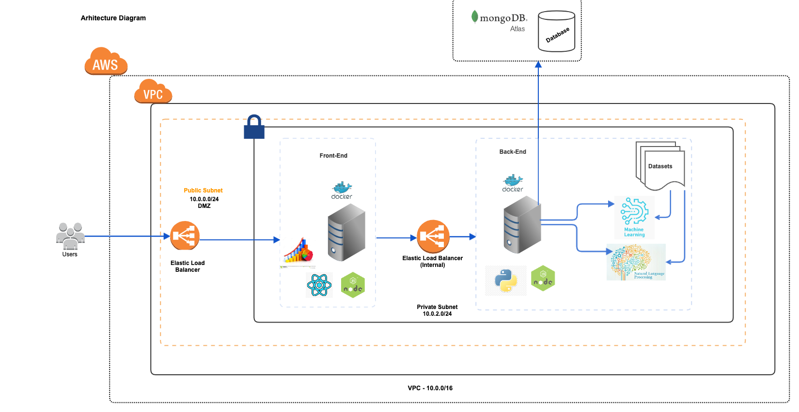

(Group Members: Amit Sharma, Ambika Na, Deepa Vyasabhat, Jaspreet Singh)

# Project Name

## Lyrics Analyser

# Abstract

There are millions of songs out there. However, only a handful of them can be considered popular. Can we build a system that can predict whether a song can be popular based on it's lyrics? Using advanced NLP and ML techniques, we think this is possible. This tool would have a significant impact on aspiring song writers.

The project is based on natural language processing over the existing lyrical dataset of over 5000+ popular songs and then using machine learning algorithms to generate a prediction model for guessing popularity of new songs based on keywords extracted from the lyrical dataset. The prediction model will be based upon the data extracted from already hit songs and will try to estimate the popularity of new songs based upon song’s length, repetition of words, usage of pop culture keywords. 

We have utilized an open source dataset from Kaggle website, consisting of 5000+ popular hit songs from various genres and timescale. The data consists of many variables like performing artist, genre, total word length, year of release. Through, natural language processing we are extracting key features to prepare our dataset which will be used by machine learning algorithms. Some of the key features in our cleaned dataset are "most often used words", "average length" etc. 
We have used knn algorithm, random forest, linear regression, logistic regression to generate a prediction model which will conclude whether a provided lyrics could be popular or not. 

We have developed a website for aspiring song writers. They can register to our system and can view their past searched lyrics. We are also providing visualisation to users based on the cleaned dataset which will help users in deciding which words to include while writing lyrics. It will also help them in gaining insights into behavior and structure of popular songs.  

This tool can be used in the music industry by artists associated with it ranging from lyricists, singers and music directors. 

# Demo

Input string: 

"Spent 24 hours I need more hours with you You spent the weekend Getting even, ooh ooh We spent the late nights Making things right, between us But now it's all good baby Roll that Backwood baby And play me close 'Cause girls like you Run around with guys like me 'Til sundown, when I come through I need a girl like you, yeah yeah Girls like you Love fun, yeah me too What I want when I come through I need a girl like you, yeah yeah Yeah yeah yeah Yeah yeah yeah I need a girl like you, yeah yeah Yeah yeah yeah Yeah yeah yeah I need a girl like you, yeah yeah I spent last night On the last flight to you Took a whole day up Trying to get way up, ooh ooh We spent the daylight Trying to make things right between us And now it's all good baby Roll that Backwood baby And play me close 'Cause girls like you Run around with guys like me 'Til sundown, when I come through I need a girl like you, yeah yeah Girls like you Love fun, yeah me too What I want when I come through I need a girl like you, yeah yeah Yeah yeah yeah Yeah yeah yeah I need a girl like you, yeah yeah Yeah yeah yeah Yeah yeah yeah I need a girl like you, yeah yeah I need a girl like you, yeah yeah I need a girl like you Maybe it's 6:45 Maybe I'm barely alive Maybe you've taken my shit for the last time, yeah Maybe I know that I'm drunk Maybe I know you're the one Maybe I'm thinking it's better if you drive 'Cause girls like you Run around with guys like me 'Til sundown, when I come through I need a girl like you, yeah yeah 'Cause girls like you Run around with guys like me 'Til sundown, when I come through I need a girl like you, yeah yeah Girls like you Love fun, yeah me too What I want when I come through I need a girl like you, yeah yeah Yeah yeah yeah Yeah yeah yeah I need a girl like you, yeah yeah Yeah yeah yeah Yeah yeah yeah I need a girl like you"

Output:

# Architecture Diagram

Link of architecture diagram:
https://github.com/SJSUSpring2020-CMPE272/Lyrics-Analyser/blob/master/Architecture/architecture.png

# Technology Stack

Frontend: React, AntDesign CSS ,React-viz, D3-cloud 

Backend: NodeJS, express, Python, mongoDB 

Libararies : numpy , scikit.learn , Pandas

Deployment: Dockers/containers running on Amazon EC2 instances Load balanced with network ELB. 

Dataset: open source dataset from Kaggle website, consisting of 5000+ popular hit songs 

